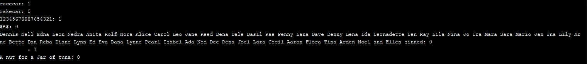
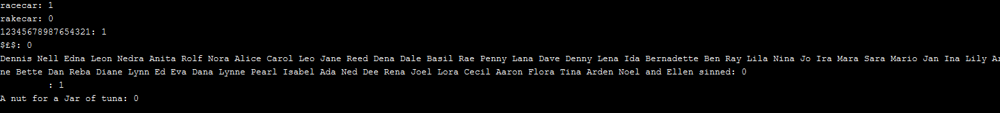
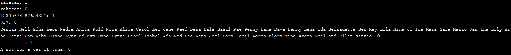

# THE WINNER OF ROUND 2 IS TREVOR!
# Coding Challenge 2 - Palindro-Mania
Challenge: Create a function "isPalindrome()" that returns true if the provided string is a palindrome. False otherwise. This function must be recursive. If the length of the string is 0 or 1, the function should return true.
## Gearoid
```
//Gearoids cpp function to check for a symmetrical word (palindrome)
#include <iostream>
#include <string>

using namespace std;

//Take a string and continually reduce as long as it has symmetrical letters
//When the symmetry is broken return false
//If the string is reduced to the point where symmetry is certain, return true
bool isPalindrome(string in){
    if(in[0] != in[in.length()-1]) 
        return false; //when two symmetric letters do not match
    else if(in.length()<2)
        return true; //when the string is too small for any more comparisons
    else
        return isPalindrome(in.substr(1,in.length()-2)); //if the letters matched but the string still has remaining comparisons
}
```
Sample Output: 

**Pros**
1. Works for simple palindromes e.g. racecar
1. Nice commenting
1. Simple
1. Only uses 2 libraries
1. It's definitely recursive

**Cons**
1. Uses namespace std
1. Doesn't account for capitals
1. Fails on palindromic sentences
1. Fails on symbols for an unidentifiable reason
1. Variable 'in' appears throughout the code, but needs a better name

## Romulus
```
#include <stdio.h>  //ios
#include <stdlib.h> //malloc
#include <string.h> //strlen
#include <ctype.h>  //isalnum

#define RECURSIVE 1

#if RECURSIVE
int isPallindrome(const char* _str, unsigned int _length, unsigned int _pos)
{
    if (_pos >= _length / 2) // If current iteration is at halfway point
        return 1;

    if (_str[_pos] == _str[_length - _pos - 1]) // If pallindrome so far, keep going
        return isPallindrome(_str, _length,_pos + 1);

    else // No longer pallindrome, return false
        return 0;
}
#endif // RECURSIVE
```

**Pros**
1. The logic is sound
1. It's definitely recursive
1. Submitted some data sanitation, which was good but I only wanted the function - the code was misplaced in the main().

**Cons**
1. Mispelled palindrome like 4 times
1. Written in C
1. Variables have undescriptive names and no comments

## Jarek
```
#include <stdio.h>
#include <string>


bool IsPalindrome(const char* input, std::size_t index = 0)
{
    if(std::tolower(input[index]) != std::tolower(input[strlen(input) - 1 - index]))
    {
        return false;
    }
    if(index < (strlen(input) / 2))
    {
        IsPalindrome(input, ++index);
    }
    else
    {
        return true;
    }
}


bool IsPalindrome(std::string& input, std::size_t index = 0)
{
    if(std::tolower(input[index]) != std::tolower(input[input.length() - 1 - index]))
    {
        return false;
    }
    if(index < (input.length() / 2))
    {
        IsPalindrome(input, ++index);
    }
    else
    {
        return true;
    }
}


int main()
{
    std::string const InputStrings[] =
    {
        "azba"
        , "."
        , "    "
        , "a"
        , "1"
        , "Aba"
        , "b"
        , "cH"
        , "zaa..aaZ"
        , "35231"
        , "&&^$^"
    };

    printf("----------\n\nconst char*\n\n----------\n\n");
    for(std::string input : InputStrings)
    {
        printf("Input: %s\n%s\n\n", input.c_str(), (IsPalindrome(input.c_str()) ? "true" : "false"));
    }

    printf("----------\n\nstd::string\n\n----------\n\n");
    for(std::string input : InputStrings)
    {
        printf("Input: %s\n%s\n\n", input.c_str(), (IsPalindrome(input) ? "true" : "false"));
    }
    return 0;
}
```
Sample Output: 

**Pros**
1. Works for simple palindromes e.g. racecar

**Cons**
1. Gave two isPalindrome() functions
1. Couldn't follow the logic by reading the code
1. Variable names a serious problem - "input"
1. Fails on palindromic sentences
1. Fails on symbols for an unidentifiable reason
1. Doesn't account for capitals

## Trevor
```
/// <summary>Use to check if the first & last characters in a String are equal</summary>
/// <param name="strToCheck">String to be Examined</param name>
/// <returns>True if the first & last are equal, else False.</returns>
bool checkFirstLastCharsEqual(std::string strToCheck) {
    return (strToCheck[0] == strToCheck[strToCheck.length() - 1]) ? true : false;
}

/// <summary>Determines if the given string is a Palindrome.  Function operates Recursively</summary>
/// <param name="palinCheck">String to be Examined</param name>
/// <returns>1 if the string is a Palindrome, else 0.</returns>
int isPalindrome(std::string palinCheck) {
    if (palinCheck.length() < 2) {
        return 1;
    } else if (checkFirstLastCharsEqual(palinCheck)) {
        std::string nextPalinCheck = palinCheck.substr(1,(palinCheck.length() - 2));
        return isPalindrome(nextPalinCheck);
    } else return 0;
}
```
Sample Output: 

**Pros**
1. Good commenting
1. Good variable names
1. Featherweight - no libraries!
1. Works for simple palindromes

**Cons**
1. Fails on palindromic sentences
1. Fails on symbols for an unidentifiable reason
1. Doesn't account for capitals

## Matt
```
void CheckIfPalindrome(std::string word_to_test, int index, bool & isPalindrome) {
    if (index < word_to_test.length()) {
        if (word_to_test[index] == word_to_test[word_to_test.length() - (index + 1)]) {

            CheckIfPalindrome(word_to_test, index + 1, isPalindrome);
            isPalindrome = true;
        }
        else isPalindrome = false;
    }
    //tbh i dont think the following block ever gets executed but oh well
    else if (index > word_to_test.length() - (index + 1)) {
        //we got to the middle of the word on both sides,
        //And, well done team, it was all the same.
        std::cout << "ah yeah";
            isPalindrome = true;
    }
    
}
```

**Pros**

**Cons**
1. Asked for "isPalindrome", gives "CheckIfPalindrome()"
1. Riddled.